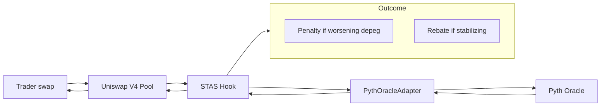
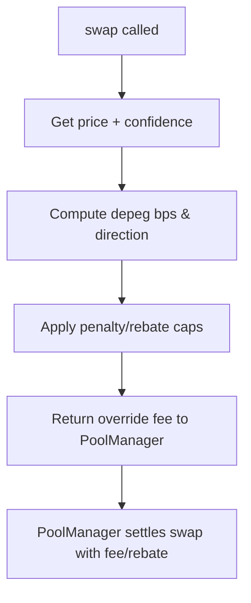

# STAS Hook

**Smart Threshold-Activated Stability Hook for Uniswap V4**

[](https://book.getfoundry.sh/)
[](https://docs.soliditylang.org/)
[](https://pyth.network/)

## Description
STAS Hook is a Uniswap V4 hook that stabilizes 1:1 pools (e.g., USDC/USDT) by using Pyth oracle prices to dynamically adjust swap fees. Trades that worsen a depeg pay higher fees; trades that restore the peg get rebates. The result is a self-balancing mechanism that protects LPs and keeps user incentives aligned with pool health.

## Problem Statement
Stable pairs drift from parity during stress due to liquidity imbalance, oracle latency, and adversarial arbitrage. LPs absorb losses while users face unfair pricing. Traditional static fees do not adapt quickly enough to discourage harmful flow or reward stabilizing trades.

## Solution & Impact
- **Dynamic, oracle-driven fees:** Pulls real-time Pyth prices and confidence to scale penalties or rebates per trade direction.
- **Threshold-aware:** Detects depeg magnitude and direction to decide whether to penalize or reward.
- **Financial impact:** Reduces LP downside during depegs (fewer losses from toxic flow) and preserves liquidity depth; incentivizes restorative trades, improving market quality and fee revenue sustainability. Rebates align trader behavior with parity restoration, keeping pool TVL healthier and fee revenue more stable.

## Architecture at a Glance
- **STASHook (Uniswap V4 hook):** Implements `BaseOverrideFee` to set per-swap fees based on oracle signals.
- **PythOracleAdapter:** Fetches price and confidence; computes a confidence-weighted ratio used by the hook.
- **MockERC20 (test reserve token):** Used in fork/demo flows for paying penalties/rebates.
- **Deployment scripts:** CREATE2/HookMiner-based deployment for deterministic hook addresses.
- **Fork/demo scripts:** Showcase hook logic on a mainnet fork with mocked oracle updates.

## Diagrams
**User swap flow**


**Hook fee calculation (technical)**


## Flows (user + judge view)
- **User perspective:** Swap on a STAS-enabled pool → hook reads Pyth price → if swap worsens the depeg, fee increases; if it helps, fee decreases and rebates accrue to the trader.
- **Judge/technical perspective:** `swap` → `BaseOverrideFee.getFee` → hook computes depeg basis points from Pyth price/confidence → applies penalty or rebate bounds → returns fee to PoolManager → Uniswap V4 core enforces it on the swap.

## Tests and 100% Forge Coverage
- Unit: hook fee math, oracle adapter, mock token.
- Integration/fork: end-to-end fee behavior demonstration against forked state.
- Commands:
  - `forge test --fork-url https://ethereum-rpc.publicnode.com -vvvvv`
  - `forge coverage`
- Coverage goal: 100% for core contracts (`STASHook`, `PythOracleAdapter`, harnesses); exclude scripts where appropriate.

## Demo (Fork Script)
Run the README-aligned fork demo that logs scenarios (worsening depeg, stabilizing, no depeg):
```bash
forge script script/testing/ForkHookIntegration.s.sol:ForkHookIntegration \
  --fork-url $MAINNET_RPC_URL -vvv
```
Requires `.env` with `MAINNET_RPC_URL`, `PYTH_ADDRESS`, `PRICE_FEED_ID0/1`, `RESERVE_TOKEN`, and `PRIVATE_KEY` (admin defaults to that key).

## Demo Example (txids placeholder)
If you run a live Sepolia demo, capture txids here for judges:
- Hook deployment: `<txid>`
- Adapter deployment: `<txid>`
- Test token deployment: `<txid>`
- Sample swap with penalty/rebate: `<txid>`

## Deployed Addresses (Sepolia)
Mirror these in `.env` when live:
- `PYTH_ORACLE_ADAPTER_ADDRESS=<...>`
- `STAS_HOOK_ADDRESS=<...>`
- `RESERVE_TOKEN=<...>` (test token)
- `POOL_MANAGER_ADDRESS=<...>`

## Install & Setup
```bash
forge install
npm install
```
Create `.env` with at least:
```
PRIVATE_KEY=0x...
SEPOLIA_RPC_URL=...
ETHERSCAN_API_KEY=...
MAINNET_RPC_URL=...
POOL_MANAGER_ADDRESS=...
PYTH_ADDRESS=...
PRICE_FEED_ID0=...
PRICE_FEED_ID1=...
RESERVE_TOKEN=...
```

## Run Tests & Scripts
- Tests: `forge test --fork-url https://ethereum-rpc.publicnode.com -vvvvv`
- Coverage: `forge coverage`
- Fork demo: see **Demo** above.
- Deploy Sepolia (example scripts): `script/DeploySTASHookSepolia.s.sol`, `script/DeployTestTokenSepolia.s.sol`.

## Roadmap
- Hardened invariant tests for extreme depeg paths.
- Gas profiling and fee-calibration sweeps.
- Additional oracle feeds and multi-asset pool support.
- UI/analytics panel for live fee and depeg telemetry.

## Project Vision
Deliver a production-ready, oracle-driven stability layer for stable pairs on Uniswap V4 that protects LPs, rewards stabilizing flow, and keeps parity even under stress.
